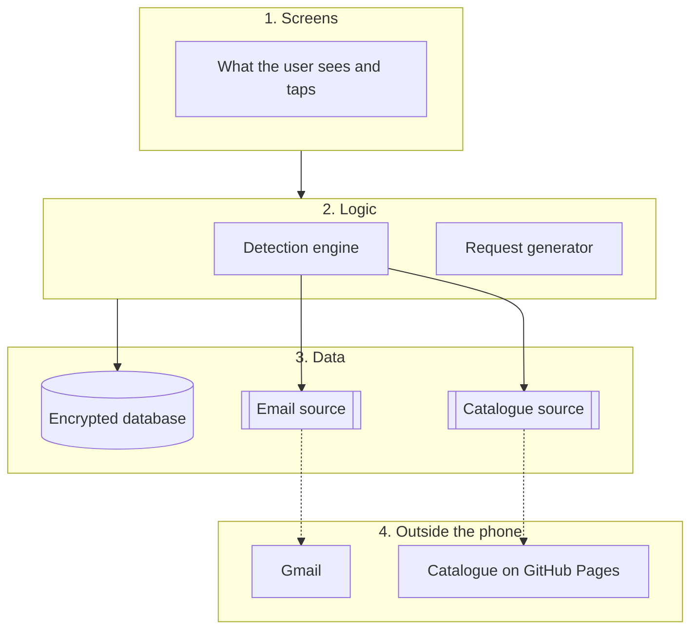
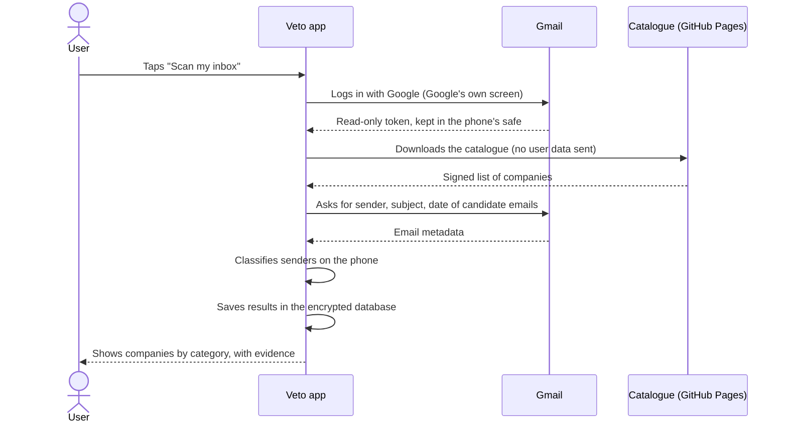

# Veto: Technical Architecture

> Resolves #2 · Status: draft waiting for review
>
> This document explains how the Veto app is built: which technologies we use, how the code is organised, and what happens inside the app when the user scans their inbox or prepares a request. It follows the rules set in [MVP_SCOPE.md](MVP_SCOPE.md) and [SECURITY_AND_PRIVACY.md](SECURITY_AND_PRIVACY.md).

## 1. The idea in one paragraph

Most apps have a server that stores users' data and does the heavy work. **Veto has no server of its own.** Everything happens on the user's phone: the app talks directly to Gmail, analyses the emails on the phone, and keeps the results in an encrypted database on the phone. The only thing we put online is a public file listing companies and their privacy contacts (the catalogue). It contains no user data.

## 2. Technologies

| What | Technology | What it does in Veto |
|---|---|---|
| App | **React Native with Expo**, written in **TypeScript** | One codebase that runs on both iPhone and Android. We chose it because the team already knows React and TypeScript, so the semester goes into building Veto, not learning a new language. |
| Local database | **SQLite** (`expo-sqlite`), encrypted with **SQLCipher** | Stores the results of scans, the requests the user prepared, their dates and notes. Encrypted so that nobody can read it without the key. |
| Key and token storage | **`expo-secure-store`** | Keeps the database key and the Gmail login token in the phone's own safe (Keychain on iPhone, Keystore on Android). |
| Gmail login | **Google OAuth 2.0** (`expo-auth-session`) | The user logs into Google on Google's own screen. Veto never sees the password; it only receives a token with read-only permission. |
| Reading email | **Gmail API** | The app asks Gmail directly, from the phone, for the sender, subject and date of selected emails. |
| Classifying senders | **Our own TypeScript code** (rules and lookups) | Decides whether each sender is a `likely account`, a `purchase`, a `newsletter`, or `unknown`. No AI service and no external server is involved. |
| Catalogue hosting | **GitHub Pages** | Serves the public, signed list of companies and privacy contacts. Free, and it never receives user data. |

## 3. How the code is organised

The app is split into four layers. Each layer has one job and only talks to the layer next to it. This keeps the code easy to test, and it means that a problem in one part (for example, Google login not working) does not block the rest of the team.

**1. Screens.** Everything the user sees: onboarding, scan results, request drafts, the list of requests and their deadlines. Screens show information and pass on what the user taps. They never read emails or write to the database themselves.

**2. Logic.** The two parts that do the real work:
- **Detection engine.** Takes the list of senders and subjects, compares each sender with the catalogue, applies simple rules to the subject (for example, "Welcome to" suggests an account, "Your order" suggests a purchase), and produces the list of companies in four categories. For each company it keeps the evidence: which email, which subject, which date.
- **Request generator.** Takes the company, the right the user chose (access, portability, or erasure) and the matching legal template, and produces the text of the request. It then opens that text as a draft in the user's email app, or copies it if there is no email app.

**3. Data.** Where information comes from and where it is kept:
- **Encrypted database**, with all results and requests.
- **Email source**, which gets email data. In the real app it asks Gmail; in demo mode it reads a simulated inbox stored inside the app.
- **Catalogue source**, which gets the list of companies. In the real app it downloads it from GitHub Pages and checks the signature; in tests it uses a local copy.

**4. Outside the phone.** Only two services: Gmail (which already holds the user's emails) and GitHub Pages (which only serves the public catalogue).

## 4. What happens during a scan

The emails are analysed in the phone's memory. Only the results (company, category, evidence) are saved, and only on the phone.

## 5. What happens when the user prepares a request

1. The user picks a company and a right (for example, "erase my data").
2. The request generator fills the legal template with the company's privacy contact.
3. The app opens the draft in the user's email app (for example, Gmail or Mail). If that fails, the user taps **"Copy request"** and pastes it anywhere.
4. The user sends the email from their own email app. **Veto never sends email.**
5. When the user comes back to Veto, the app notices it returned to the screen and asks **"Did you send this request?"**.
6. If the user says yes, Veto saves the date and shows the estimated reply deadline, and schedules a reminder on the phone.

## 6. Working without Gmail

The **email source** and the **catalogue source** are written as interfaces: a description of what they must provide, with two versions behind each one.

| Part | Real version | Test and demo version |
|---|---|---|
| Email source | Reads from Gmail with the user's permission | Reads a simulated inbox stored in the app |
| Catalogue source | Downloads from GitHub Pages and checks the signature | Uses a local copy |

Because the rest of the app does not know which version it is using, the team can build and test the whole app, and give the full demo, without connecting to Gmail. This is what makes Milestone A (demo) and Milestone B (real Gmail) independent, as described in [MVP_SCOPE.md, Section 8](MVP_SCOPE.md#8-acceptance-criteria).

## 7. Packages we plan to use

| Need | Package |
|---|---|
| Moving between screens | `expo-router` (works like routing in Next.js) |
| Google login | `expo-auth-session` |
| Keeping keys and tokens safe | `expo-secure-store` |
| Local encrypted database | `expo-sqlite` with the SQLCipher option |
| "Copy request" button | `expo-clipboard` |
| Opening the email draft | `Linking` from React Native (`mailto:`) |
| Knowing the user came back to the app | `AppState` from React Native |
| Deadline reminders | `expo-notifications` (local notifications only) |
| Shared app state | React hooks, or Zustand if needed |

**A practical note.** For quick prototyping, Expo offers an app called Expo Go. It cannot run the encrypted database or the full Google login, so for those the team uses an **Expo development build**, a version of the app built for our own test phones. It is set up once at the start of the project.

## 8. Where AI fits

AI is not required for the MVP (decision D0). Detection works with rules and the catalogue. If the team has time, an on-device model is added as an **optional extra step inside the detection engine**, only for senders the rules leave as `unknown`. Nothing else in the app changes, and if the phone cannot run the model, those senders simply stay `unknown` for the user to review. See [MVP_SCOPE.md, Section 10](MVP_SCOPE.md#10-decisions).

