# Veto: MVP Scope

> Closes #1 · Status: draft waiting for review · Scope freeze: end of Phase 0
>
> This is one of three documents:
> - **MVP_SCOPE.md** (this file): what we build this semester, what we leave out, how we know it works, and what is still undecided.
> - [PRODUCT_STRATEGY.md](PRODUCT_STRATEGY.md): personas to validate, monetisation, business customers, desktop, and the Personal Data Map.
> - [SECURITY_AND_PRIVACY.md](SECURITY_AND_PRIVACY.md): data flow, OAuth permissions, local storage, threat model, and the plan for a public launch.

## 1. Vision

Personal data is scattered across services people use and others they may have forgotten. People have rights over that data, but exercising them means identifying the companies involved, finding the right contact, preparing requests, and keeping track of responses. As more services collect and use personal data, that work becomes harder to manage.

Veto is a mobile app that brings those steps into one guided process. It scans the user's inbox to suggest companies they may have dealt with, matches them against a curated directory of privacy contacts, and lets the user review each result. It then helps prepare requests to access, port, or erase data, which the user sends from their own email, and keeps track of what happens next.

Veto is designed to keep that process private. **Emails downloaded by the app are analysed on the device. Veto does not receive or store emails or exposure maps on its servers.** There is no account with Veto. The user decides which companies to act on, which requests to send, and what to keep on their phone.

### What makes Veto different

- **It finds the companies for you.** Request generators assume you already know who has your data; Veto starts from your own inbox.
- **No Veto server ever holds your mailbox or your results.** The analysis runs on the phone, and there is no account.
- **Requests come from your own email.** Companies reply directly to you; Veto never acts as an intermediary.
- **Honest results.** Every company comes with its evidence, and every status says who established it.
- **Built for Portugal first**, with local companies, Portuguese templates, and references to the CNPD.

The full comparison with Mine, data broker removal services, and request generators is in [PRODUCT_STRATEGY.md](PRODUCT_STRATEGY.md#3-competition-and-what-makes-veto-different).

## 2. Initial audience for the semester

The MVP targets Gmail users in Portugal who have accumulated accounts across many services. We work with three user groups (university students, privacy-conscious adults, and adults with forgotten accounts). What we believe about each group is still a **hypothesis** to test in the Phase 1 interviews, not confirmed behaviour. The full descriptions, and the questions each interview must answer, are in [PRODUCT_STRATEGY.md](PRODUCT_STRATEGY.md#2-personas-hypotheses-to-validate).

## 3. How Veto works, in one paragraph

Veto is a cross-platform mobile app built with React Native (Expo). The user authorises read-only access to Gmail from inside the app. The app downloads the metadata of candidate messages from Google, analyses it on the phone, and stores the results in a local encrypted database. To send a request, Veto opens the user's own email app with a prepared draft. The only infrastructure Veto hosts is a public, signed file with the catalogue of companies and their privacy contacts. The technologies and code structure are in [ARCHITECTURE.md](ARCHITECTURE.md); the full data flow, permissions, and protections are in [SECURITY_AND_PRIVACY.md](SECURITY_AND_PRIVACY.md).

## 4. In scope

**Onboarding.** Open the app, read a short screen explaining what Veto does with data, and start. There is no sign-up. The user can turn on an app lock that uses the phone's own biometrics or PIN. The onboarding also says clearly that the history lives only on this phone and is lost if the phone is lost or replaced (see Section 9).

**Email source.**
- Real Gmail connection with the `gmail.readonly` OAuth scope, called directly from the device. Only metadata (sender, subject, date) of candidate messages is downloaded. In the MVP this works only for the team and invited testers, because the Google project is in Testing mode.
- Demo mode with a simulated inbox of realistic messages from Portuguese and international services. It needs no login and is the main path for the pitch.

**Detection.** Each detected sender is placed in one of four categories, because not every email proves an account:

| Category | Typical evidence | What it tells the user |
|---|---|---|
| `likely account` | Welcome email, sign-up confirmation, password reset | You probably have an account with this company |
| `purchase` | Receipt, order confirmation, invoice | You bought something; the company holds purchase data |
| `newsletter` | Marketing email only | The company has your email address; an account is not proven |
| `unknown` | Sender recognised, but no rule matched | Something links you to this company; review it |

- The category comes from matching the sender's domain against the catalogue and from a small set of rules on subject lines.
- For each result, Veto shows the evidence it used (sender, subject, date), so the user can judge it.
- The user confirms, dismisses, or re-categorises a result, or adds a company by hand.

**Local AI step** (optional, stretch goal; see D0 and D1). Rules and the catalogue do the main detection. As an extra step, an on-device model can try to classify the senders that the rules leave as `unknown`, which is where small Portuguese shops tend to end up. It runs only on compatible phones, and its results are compared with rules alone on the labelled test set. The main flow never depends on it: if the model is unavailable, results stay `unknown` and the user reviews them.

**Company catalogue.**
- At least twenty companies relevant to Portuguese users.
- Each entry has the company name, the sender domains it uses, its published privacy contact, the URL of the page where that contact was published, and the date the team last checked it.
- In the app, a catalogue contact is shown as **"contact published by the company, checked on [date]"**, never as a guarantee that the request will be delivered or accepted. The user can always edit the recipient before the draft opens.
- Companies outside the catalogue appear as "contact not verified", with a link to the company's privacy policy so the user can find and confirm the contact.

**Requests.**
- Three legally reviewed templates: access (Article 15), portability (Article 20), and erasure (Article 17), in Portuguese and English.
- Veto fills the template with the chosen right and the contact, and opens the draft in the user's email app via `mailto:`.
- A **"Copy request"** button is always available, for when there is no working email app on the phone, or the draft does not open correctly. The user can paste the text and the address into any email service.

**Tracking.**
- States with a clear origin: `draft`, `sent (indicated by user)`, `reply received (indicated by user)`, `closed`.
- When the user marks a request as sent, Veto records the date and shows an estimated reply date, based on the one-month period the GDPR gives companies, plus a small buffer. The user can adjust it.
- Local reminder when the estimated date passes with no reply marked.

**Reducing manual effort** (see Section 9).
- When the user returns to Veto after the draft opened, Veto asks straight away "Did you send this request?" with a one-tap answer.
- Batch mode: select several companies and one right, then go through the drafts one after another.
- Deadline reminders that ask "Did the company reply?" with one-tap answers.
- A "report a missing company" button.
- A short in-app guide explaining what a company's data export usually contains.
- Stretch goal: a follow-up draft for overdue requests, reminding the company of Article 12 and the original request date.

**Privacy and security.**
- Transparency screen describing in plain language what the app reads, what it stores, and what leaves the device.
- "Delete everything" in one action: wipes the local database and revokes the Gmail token.
- The local protections listed in [SECURITY_AND_PRIVACY.md](SECURITY_AND_PRIVACY.md#5-local-storage-and-threat-model) (encrypted database, no backups of Veto data, protected screens, no sensitive content in logs).

## 5. Out of scope

- Any external AI service that receives content or metadata from user emails.
- Making any part of the main flow depend on an AI model.
- Automatic discovery of privacy contacts for companies outside the catalogue (parsing web pages, guessing addresses, DNS checks).
- Email providers other than Gmail, and email file import (`.mbox`, `.eml`). Planned after the MVP.
- Sending email from Veto's own infrastructure, and the `gmail.send` OAuth scope.
- Automatic reading of company replies.
- Complaints to the CNPD and other escalation flows.
- Filling in companies' web privacy forms.
- Backup, sync, or transfer of the history to another phone (see Section 9).
- Multi-language interface. Templates in Portuguese and English are enough.
- Payments and plans (see [PRODUCT_STRATEGY.md](PRODUCT_STRATEGY.md#7-monetisation)).
- Desktop app, browser extension, password manager import.
- Any business-to-business feature.
- Zero-knowledge attribute proofs. Future vision only.
- Public distribution outside the Google test user list (see [SECURITY_AND_PRIVACY.md](SECURITY_AND_PRIVACY.md#8-requirements-before-a-public-launch)).

## 6. Main user flow

```mermaid
flowchart LR
    A[Open app] --> B[Privacy explanation]
    B --> C{Email source}
    C -->|Connect Gmail| D[Scan on device]
    C -->|Demo mode| D
    D --> E[Results by category]
    E -->|In catalogue| F[Prepare request]
    E -->|Not in catalogue| G[User confirms contact from privacy policy]
    G --> F
    F --> H[Draft opens in user's email app]
    F -.->|No email app| H2[Copy request]
    H --> I[User sends in email app]
    H2 --> I
    I --> J[Back in Veto: Did you send it?]
    J --> K[Track estimated deadline]
    K -->|Reply arrives| L[User marks reply received]
```

1. Open the app and read a short explanation of what Veto does with data.
2. Choose an email source: connect Gmail (invited testers only) or start demo mode.
3. Veto downloads candidate metadata and analyses it on the phone.
4. Results appear by category (`likely account`, `purchase`, `newsletter`, `unknown`), each with its evidence. The user confirms, dismisses, re-categorises, or adds companies.
5. For a chosen company, the user picks a right. Veto prepares the draft with the correct template and the contact, which the user can edit.
6. The draft opens in the user's email app, or the user copies the request if there is no working email app. The user sends it there.
7. Back in Veto, the app asks "Did you send this request?". The user confirms, and Veto shows the estimated reply date.
8. When a reply arrives, the user marks it as received.

## 7. What "sending" actually means

Veto does not send email. It prepares a request and opens the user's email app with the draft ready, or lets the user copy it. The request is only delivered when the user taps send in their email app.

Veto cannot see whether that happened, which is why the status only changes to `sent (indicated by user)` when the user confirms it. The GDPR gives companies one month from receipt of the request, extendable in certain cases, so the deadline Veto shows is an estimate the user can adjust.

The path "open draft → send → return to Veto → mark as sent" is the most fragile moment of the product, because it crosses into an app Veto does not control. It must be tested on both iPhone and Android, with the default mail apps and with Gmail as the mail app, and with no mail app configured (where "Copy request" takes over).

## 8. Acceptance criteria

The MVP has **two independent milestones**. Each one is demonstrated on its own, so a problem with Google's OAuth never hides the state of the rest of the product, and a working demo never hides an unfinished Gmail integration.

### Milestone A: complete demo with the simulated inbox

1. A user opens the app, reads the privacy explanation, and starts demo mode. No account is created.
2. Results appear in the four categories, each with its evidence.
3. The user prepares a request for a catalogue company. The contact is shown as "published by the company, checked on [date]" and can be edited.
4. The draft opens in the email app on an iPhone and on an Android phone. "Copy request" works when no email app is available.
5. Returning to Veto triggers "Did you send this request?", and the dashboard then shows the estimated reply date.
6. "Delete everything" wipes all local data in one action.
7. One person from outside the team completes the whole flow without help.

### Milestone B: real Gmail on a real device

1. An invited tester connects their Gmail account on a physical phone, through the OAuth consent screen.
2. The scan downloads only metadata of candidate messages and produces categorised results.
3. Disconnecting Gmail, or "Delete everything", revokes the token, and this is checked in the tester's Google account settings.
4. Re-authorisation after the Testing-mode expiry works without losing local history.

### Quality measures

Recognising a sender is not the same as being useful. Besides the number of senders recognised, we measure:

- **Confirmation rate:** of the suggestions shown to testers, how many they confirm, per category.
- **Dismissal rate:** how many suggestions testers dismiss as wrong or irrelevant.
- **Manual additions:** how many companies testers add by hand, which shows what the scan misses.
- Results on a labelled set of at least 100 real emails from the team's inboxes, including small Portuguese shops.

Targets for these measures are set after the first round of testers, when there is data to base them on.

### Catalogue and templates

- At least twenty companies, each with the contact, its source URL, and the date it was checked.
- Templates in Portuguese and English reviewed against the GDPR articles they cite.

Explicit non-goals: guaranteeing a reply from any company, automatic reply reading, automatic follow-up, and an AI model in the main flow.

## 9. Known limitations and how we address them

"When" uses three values: **MVP** (built this semester), **Post-MVP**, and **Accepted** (a deliberate trade-off explained to the user).

### User friction and manual effort

| Limitation | What we do about it | When |
|---|---|---|
| **Manual sending.** The user sends from their email app and comes back to Veto. | "Did you send this request?" prompt on return, answered in one tap. "Copy request" as a fallback. | MVP |
| **Many requests are repetitive.** | Batch mode goes through several drafts in sequence. | MVP |
| **Manual status updates for replies.** | Reminders near the deadline asking "Did the company reply?", with one-tap answers. | MVP |
| **The scan can produce a map of limited use.** The catalogue is small, companies use several sending domains, users may have deleted old emails, and a newsletter does not prove an account. | Four categories instead of a single list, evidence shown for every result, manual additions, and the confirmation rate measured with testers (Section 8). The catalogue is prioritised by the companies that appear most in tester inboxes and in the interviews. | MVP |
| **Companies outside the catalogue need a manual contact.** | Link to the company's privacy policy and "report a missing company" button. Later, users can opt in to share only the company domain and confirmed contact (no user data) so the team can check and add it. | MVP (button), Post-MVP (opt-in sharing) |

### No guaranteed outcomes

| Limitation | What we do about it | When |
|---|---|---|
| **Companies may not reply.** | Follow-up draft for overdue requests, citing Article 12. | MVP (stretch) |
| **A checked contact can stop working.** A contact checked on a given date may change or be rejected later. | Show the date it was checked, let the user edit the recipient, and re-check the catalogue before each release. | MVP |
| **No escalation to the CNPD.** | Post-MVP: exportable summary of the request history and a link to the CNPD complaint page, so the user can file it themselves. | Post-MVP |
| **Data exports are hard to read.** | In-app guide in the MVP; assisted reading is part of the paid plans. | MVP (guide) |
| **Users may expect a guaranteed result.** | Onboarding says clearly that Veto helps exercise rights and cannot control what companies do. | Accepted |

### Data, platform, and devices

| Limitation | What we do about it | When |
|---|---|---|
| **History is lost when the phone is lost or replaced.** No account and no server means no copy elsewhere. | Accepted for the MVP, and said clearly in onboarding and on the "Delete everything" screen. Post-MVP: an encrypted export file that the user creates, keeps, and imports on a new phone, with a password only they know. | Accepted (MVP), Post-MVP (export) |
| **Gmail only.** | Post-MVP: email file import (`.mbox`, `.eml`), which covers any provider that allows exporting, then Outlook through Microsoft Graph. | Post-MVP |
| **Mobile only.** | Post-MVP desktop app (see [PRODUCT_STRATEGY.md](PRODUCT_STRATEGY.md#5-platform-strategy)). | Post-MVP |
| **Real Gmail limited to testers.** | Milestone A does not depend on Gmail; Milestone B is tested separately (Section 8). | MVP |

## 10. Decisions

### Decided

| # | Decision | Chosen | Why |
|---|---|---|---|
| D0 | Is an AI component required by the course evaluation? | **No.** | AI is not mandatory for the MVP. It stays as an optional stretch goal (D1). |
| D1 | Detection technology | **Rules and catalogue in the main flow. Local model as an optional extra step** for senders left as `unknown`. No external AI service. | Rules are predictable, fast, testable, and work on every phone. A local model adds download size, only runs on some phones, and is harder to test, so it only helps where rules fail and never blocks the flow. |
| D2 | How requests are sent | **From the user's own mailbox**: `mailto:` draft in their email app, plus "Copy request". | Veto never sends email. The request comes from the person the data belongs to, and the company replies to them directly. |
| D3 | Contacts for companies outside the catalogue | **Catalogue plus a contact the user confirms** from the company's privacy policy. | Automatic guessing can send a request to the wrong or a non-existent address, and the user would believe it was delivered. A contact the user checked is slower but reliable. "Report a missing company" helps the catalogue grow. |
| D6 | Cross-platform framework | **React Native (Expo) with TypeScript.** | The team already knows React and TypeScript. See [ARCHITECTURE.md](ARCHITECTURE.md). |
| D7 | Google OAuth during the semester | **Testing mode**, with the team and invited testers. | No Google review is needed while testing. Testers see an "unverified app" warning and re-authorise about once a week, which fits the per-scan connection. Milestones A and B stay independent. Google verification is required before any public release (see [SECURITY_AND_PRIVACY.md](SECURITY_AND_PRIVACY.md#8-requirements-before-a-public-launch)). |

### Still open

| # | Decision | Options | Proposal |
|---|---|---|---|
| D4 | Phase 1 interviews | Students only. All three groups. | Three interviews per group (nine in total), plus one or two data protection officers. |
| D5 | Email time window scanned | One year. Five years. All. | Five years by default; the user can widen it. |
| D8 | Legal review of templates | UMinho contact. External lawyer. CNPD guidance. | Contact UMinho in Phase 2; cross-check with CNPD guidance. |
| D9 | History when the phone is lost or replaced | Accept the loss. Encrypted export file. Cloud sync. | Accept the loss in the MVP and warn the user. Encrypted export file controlled by the user after the MVP. No cloud sync. |

Decisions about the future (desktop, monetisation, business customers) are in [PRODUCT_STRATEGY.md](PRODUCT_STRATEGY.md#9-post-mvp-decisions).

## 11. Semester cost

**Infrastructure.** Effectively zero. The catalogue is hosted on GitHub Pages. There is no server, no database, and no paid AI service.

**Testing.** Zero for Android testing (direct APK install). An iPhone test build needs an Apple Developer account (99 USD per year) or the free, limited development provisioning on a team member's device; the team decides in Phase 0. Store publication is not planned this semester.

**Other.** Developer time, at least one iPhone and one Android phone for testing (one of them compatible with on-device AI, for the optional local AI step), and time for legal review of the templates.

