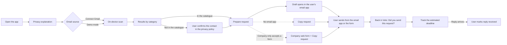

# Veto: MVP Scope

> Closes #1 · Status: draft awaiting review · Scope freeze: end of Phase 0
>
> This is one of five documents:
> - **MVP_SCOPE.md** (this file): what we build this semester, what stays out, how we know it works and what is still to be decided.
> - [PRODUCT_STRATEGY.md](PRODUCT_STRATEGY.md): personas to validate, competition, monetisation, business customers, desktop and the Personal Data Map.
> - [SECURITY_AND_PRIVACY.md](SECURITY_AND_PRIVACY.md): data flow, OAuth permissions, local storage, threat model and the plan for a public launch.
> - [ARCHITECTURE.md](ARCHITECTURE.md): technologies, how the code is organised, and what happens inside the app.
> - [DATA_CONTRACTS.md](DATA_CONTRACTS.md): the data, states and functions shared by the four workstreams.

## 1. Vision

Personal data is scattered across the services people use and others they may have already forgotten about. People have rights over that data, but exercising them means identifying the companies involved, finding the right contact, preparing the requests and following up on the replies. As more services collect and use personal data, this work becomes increasingly hard to manage.

Veto is a mobile app that brings all these steps together in a single guided process. It scans the user's inbox to suggest companies they may have dealt with, matches them against a curated directory of privacy contacts and lets the user review each result. It then helps prepare requests for access to, portability of or erasure of their data, which the user sends from their own email, and tracks what happens next.

Veto is designed to keep this process private. **Emails downloaded by the app are analysed on the device itself. Veto does not receive or store emails or exposure maps on its servers.** There is no Veto account. The user decides which companies to act on, which requests to send and what to keep on the phone.

### What makes Veto different

- **It finds the companies for you.** Request generators assume you already know who has your data; Veto starts from your own inbox.
- **No Veto server stores your inbox or your results.** The scan runs on the phone and there is no account.
- **Requests go out from your own email.** Companies reply to you directly; Veto never acts as an intermediary.
- **Honest results.** Each company comes with its evidence, and each status shows who determined it.
- **Built for Portugal first**, with local companies, Portuguese templates and references to the CNPD.

The full comparison with Mine, data broker removal services and request generators is in [PRODUCT_STRATEGY.md](PRODUCT_STRATEGY.md#3-competition-and-what-makes-veto-different).

## 2. Initial audience for the semester

The MVP is aimed at Gmail users in Portugal who have built up accounts with many services. We work with three user groups (university students, privacy-conscious adults and adults with forgotten accounts). What we believe about each group is still a **hypothesis** to be tested in the Phase 1 interviews, not confirmed behaviour. The full descriptions, and the questions each interview has to answer, are in [PRODUCT_STRATEGY.md](PRODUCT_STRATEGY.md#2-personas-hypotheses-to-validate).

## 3. How Veto works, in one paragraph

Veto is a cross-platform mobile app built with React Native (Expo). Inside the app, the user grants read-only access to Gmail. The app downloads the metadata of candidate messages from Google, analyses it on the phone and stores the results in an encrypted local database. To send a request, Veto opens the user's own email app with a draft already prepared. The only infrastructure Veto hosts is a public, signed file containing the catalogue of companies and their privacy contacts. The technologies and code structure are in [ARCHITECTURE.md](ARCHITECTURE.md); the full data flow, permissions and protections are in [SECURITY_AND_PRIVACY.md](SECURITY_AND_PRIVACY.md).

## 4. In scope

**Onboarding.** Open the app, read a short screen explaining what Veto does with data, and get started. There is no sign-up. The user can turn on an app lock that uses the phone's own biometrics or PIN. Onboarding also states clearly that the history stays only on this phone and is lost if the phone is lost or replaced (see Section 9).

**Email source.**
- Real Gmail connection with the OAuth scope `gmail.readonly`, called directly from the device. Only the metadata (sender, subject, date) of candidate messages is downloaded. In the MVP, this only works for the team and invited testers, because the Google project is in Testing mode.
- **Candidate emails selected within Gmail itself.** Veto does not download the whole inbox and filter it afterwards. It uses Gmail search (the `q` parameter) to request only the emails that may point to a relationship with a company: sign-up, purchase and subscription keywords in Portuguese and English, Gmail's own categories (Purchases, Updates, Promotions) and the time period set in D5. The search runs on Google's servers, which already hold the emails; only the metadata of the results reaches the phone, requested in batches. This saves time, battery and Gmail API quota.
- **Expired connections handled clearly.** In Testing mode, authorisation expires after about seven days. When this happens, the app does not show a technical error but a simple message ("Your Gmail connection expired for security. Tap to reconnect.") and keeps all local history intact.
- Demo mode with a simulated inbox containing realistic messages from Portuguese and international services. It needs no login and is the main path for the pitch.

**Detection.** Each detected sender is placed in one of four categories, because not every email proves that an account exists:

| Category | Typical evidence | What it tells the user |
|---|---|---|
| `likely account` | Welcome email, sign-up confirmation, password reset | You probably have an account with this company |
| `purchase` | Receipt, order confirmation, invoice | You bought something; the company holds data about the purchase |
| `newsletter` | Marketing emails only | The company has your email address; there is no proof that you have an account |
| `unknown` | Sender recognised, but no rule applied | Something links you to this company; review the result |

- The category comes from matching the sender's domain against the catalogue and from a small set of rules applied to subject lines.
- For each result, Veto shows the evidence it used (sender, subject, date), so the user can judge it.
- The user confirms, dismisses or changes the category of a result, or adds a company manually.

**Local AI step** (optional, a stretch goal; see D0 and D1). The main detection is done by the rules and the catalogue. As an additional step, an on-device model can try to classify the senders that the rules leave as `unknown`, which is where small Portuguese shops usually end up. It only runs on compatible phones, and its results are compared with those of the rules alone on the labelled test set. The main flow never depends on it: if the model is not available, the results stay as `unknown` and the user reviews them.

**Company catalogue.**
- At least twenty companies relevant to Portuguese users.
- Each entry has the company name, the sending domains it uses, the published privacy contact, the URL of the page where that contact was published and the date the team last checked it.
- Each entry also states **the channel the company accepts**: email, web form (with the form address, `webFormUrl`) or both. Some large companies, such as Meta, Google or Amazon, route privacy requests to their own forms instead of an email address.
- In the app, a catalogue contact appears as **"contact published by the company, checked on [date]"**, never as a guarantee that the request will be delivered or accepted. The user can always edit the recipient before the draft opens.
- Companies outside the catalogue appear as "contact not verified", with a link to the company's privacy policy, so the user can find and confirm the contact.

**Requests.**
- Three legally reviewed templates: access (Article 15), portability (Article 20) and erasure (Article 17), in Portuguese and English.
- Veto fills in the template with the chosen right and the contact, and opens the draft in the user's email app via `mailto:`.
- If the company only accepts requests through a web form, Veto does not generate a `mailto:`: it opens the company's form in the browser and offers "Copy request", so the user can paste the text into the form.
- A **"Copy request"** button is always available for when there is no working email app on the phone or the draft does not open correctly. The user can paste the text and the address into any email service.

**Tracking.**
- Statuses with a clear source: `draft`, `sent (indicated by user)`, `reply received (indicated by user)`, `closed`.
- When the user marks a request as sent, Veto records the date and shows an estimated reply date, based on the one-month deadline the GDPR gives companies, plus a small margin. The user can adjust it.
- A local reminder when the estimated date passes without a reply having been marked.
- **The "Did you send this request?" question is never lost.** Before opening the email app or the form, Veto saves in the local database that the request is awaiting confirmation. If the system closes Veto in the meantime (which happens on phones with little memory or when the user takes a while), the app finds the pending request when it opens again and asks the question straight away on the first screen.

**Reducing manual effort** (see Section 9).
- When the user returns to Veto after the draft opens, Veto immediately asks "Did you send this request?", answered with a single tap.
- Batch mode: choose several companies and one right, then go through the drafts one by one.
- Deadline reminders that ask "Did the company reply?", with one-tap answers.
- A "report a missing company" button.
- A short in-app guide explaining what a company's data export usually contains.
- Stretch goal: a follow-up draft for overdue requests, reminding the company of Article 12 and the date of the original request.

**Privacy and security.**
- A transparency screen that describes, in plain language, what the app reads, what it stores and what leaves the device.
- "Delete everything" in a single action: it deletes the local database and revokes the Gmail token.
- The local protections described in [SECURITY_AND_PRIVACY.md](SECURITY_AND_PRIVACY.md#5-local-storage-and-threat-model) (encrypted database, no backups of Veto data, protected screens, no sensitive content in logs).

## 5. Out of scope

- Any external AI service that receives content or metadata from the user's emails.
- Making any part of the main flow depend on an AI model.
- Automatic discovery of privacy contacts for companies outside the catalogue (scraping web pages, guessing addresses, DNS checks).
- Email providers other than Gmail, and importing email files (`.mbox`, `.eml`). Planned for after the MVP.
- Sending emails from Veto's own infrastructure, and the OAuth scope `gmail.send`.
- Automatically reading companies' replies.
- Complaints to the CNPD and other escalation flows.
- Automatically filling in companies' privacy web forms. Veto opens the right form and the user pastes in the request text.
- Backing up, syncing or transferring the history to another phone (see Section 9).
- A multilingual interface. Templates in Portuguese and English are enough.
- Payments and plans (see [PRODUCT_STRATEGY.md](PRODUCT_STRATEGY.md#7-monetisation)).
- Desktop app, browser extension, import from password managers.
- Any features for companies (business-to-business).
- Zero-knowledge attribute proofs. Future vision only.
- Public distribution beyond Google's list of test users (see [SECURITY_AND_PRIVACY.md](SECURITY_AND_PRIVACY.md#8-requirements-before-a-public-launch)).

## 6. Main user flow

1. Open the app and read a brief explanation of what Veto does with data.
2. Choose the email source: connect Gmail (invited testers only) or start demo mode.
3. Veto downloads the candidate metadata and analyses it on the phone.
4. The results appear by category (`likely account`, `purchase`, `newsletter`, `unknown`), each with its evidence. The user confirms, dismisses, changes the category or adds companies.
5. For a chosen company, the user selects a right. Veto prepares the draft with the correct template and the contact, which the user can edit.
6. The draft opens in the user's email app, or the user copies the request if there is no working email app. If the company only accepts a web form, Veto opens that form and the user pastes the text into it. That is where the user sends it.
7. Back in Veto, the app asks "Did you send this request?". The user confirms and Veto shows the estimated reply date.
8. When a reply arrives, the user marks it as received.

## 7. What "sending" actually means

Veto does not send emails. It prepares a request and opens the user's email app with the draft ready, or lets the user copy it. The request is only delivered when the user taps send in their email app.

Veto cannot see whether that happened, which is why the status only changes to `sent (indicated by user)` when the user confirms it. The GDPR gives companies one month from receipt of the request, extendable in certain cases, so the deadline Veto shows is an estimate the user can adjust.

The path "open draft → send → return to Veto → mark as sent" is the most fragile moment in the product, because it passes through an app Veto does not control. It has to be tested on iPhone and on Android, with the default email apps and with Gmail as the email app, and also with no email app set up (which is where "Copy request" comes in). It also has to be tested for the case where the system closes Veto while the user is in the email app: on returning, the "Did you send this request?" question must still appear.

## 8. Acceptance criteria

The MVP has **two independent milestones**. Each one is demonstrated separately, so that a problem with Google OAuth never hides the state of the rest of the product, and so that a working demo never hides an unfinished Gmail integration.

### Milestone A: complete demo with the simulated inbox

1. A user opens the app, reads the privacy explanation and starts demo mode. No account is created.
2. The results appear in the four categories, each with its evidence.
3. The user prepares a request for a company in the catalogue. The contact appears as "published by the company, checked on [date]" and can be edited.
4. The draft opens in the email app on an iPhone and on an Android phone. "Copy request" works when no email app is available. For a company that only accepts a web form, Veto opens the correct form.
5. Returning to Veto brings up the question "Did you send this request?", even if the system has closed Veto in the meantime, and the dashboard then shows the estimated reply date.
6. "Delete everything" deletes all local data in a single action.
7. Someone from outside the team completes the whole flow without help.

### Milestone B: real Gmail on a real device

1. An invited tester connects their Gmail account on a physical phone, through the OAuth consent screen.
2. The scan selects candidate emails using Gmail search, downloads only their metadata and produces categorised results. The scan time on a real inbox is measured; the target is set after the first tests.
3. Disconnecting Gmail, or using "Delete everything", revokes the token, and this is verified in the tester's Google account settings.
4. When the authorisation expires (Testing mode), the app shows the simple expired-connection message, and reconnecting works without losing the local history.

### Quality measures

Recognising a sender is not the same as being useful. Besides the number of recognised senders, we measure:

- **Confirmation rate:** of the suggestions shown to testers, how many they confirm, by category.
- **Dismissal rate:** how many suggestions testers dismiss because they are wrong or not relevant.
- **Manual additions:** how many companies testers add by hand, which shows what the scan misses.
- Results on a labelled set of at least 100 real emails from the team's inboxes, including small Portuguese shops.

The targets for these measures are set after the first round of testers, once there is data to base them on.

### Catalogue and templates

- At least twenty companies, each with its contact, source URL and the date it was checked.
- Templates in Portuguese and English reviewed against the GDPR articles they cite.

Explicitly not goals: guaranteeing a reply from any company, automatically reading replies, automatic follow-ups, and an AI model in the main flow.

## 9. Known limitations and how we address them

The "When" column uses three values: **MVP** (built this semester), **Post-MVP** and **Accepted** (a deliberate trade-off, explained to the user).

### User friction and manual effort

| Limitation | What we do | When |
|---|---|---|
| **Manual sending.** The user sends from their email app and comes back to Veto. | The "Did you send this request?" question on return, answered with a single tap. "Copy request" as a fallback. | MVP |
| **Many requests are repetitive.** | Batch mode goes through several drafts in a row. | MVP |
| **Manual updates to reply status.** | Reminders near the deadline asking "Did the company reply?", with one-tap answers. | MVP |
| **The scan may produce an unhelpful map.** The catalogue is small, companies use several sending domains, users may have deleted old emails, and a newsletter does not prove that an account exists. | Four categories instead of a single list, evidence shown for every result, manual additions, and the confirmation rate measured with testers (Section 8). The catalogue is prioritised by the companies that appear most often in testers' inboxes and in the interviews. | MVP |
| **Some companies only accept requests through a web form.** | The catalogue records the form (`webFormUrl`); Veto opens it and the user pastes in the request with "Copy request". Tracking works the same way. | MVP |
| **Companies outside the catalogue need a manual contact.** | A link to the company's privacy policy and a "report a missing company" button. Later, users can choose to share only the company's domain and the confirmed contact (no user data), so the team can verify it and add it. | MVP (button), Post-MVP (optional sharing) |

### No guaranteed outcomes

| Limitation | What we do | When |
|---|---|---|
| **Companies may not reply.** | A follow-up draft for overdue requests, citing Article 12. | MVP (stretch goal) |
| **A verified contact may stop working.** A contact verified on a given date may change or be rejected later. | Show the date it was checked, let the user edit the recipient, and re-check the catalogue before each release. | MVP |
| **No escalation to the CNPD.** | Post-MVP: an exportable summary of the request history and a link to the CNPD complaints page, so the user can file the complaint themselves. | Post-MVP |
| **Data exports are hard to read.** | An in-app guide in the MVP; assisted reading is part of the paid plans. | MVP (guide) |
| **Users may expect a guaranteed outcome.** | Onboarding states clearly that Veto helps people exercise their rights and does not control what companies do. | Accepted |

### Data, platform, and devices

| Limitation | What we do | When |
|---|---|---|
| **The history is lost when the phone is lost or replaced.** With no account and no server, there is no copy anywhere else. | Accepted for the MVP, and stated clearly in onboarding and on the "Delete everything" screen. Post-MVP: an encrypted export file that the user creates, stores and imports on a new phone, protected by a password only they know. | Accepted (MVP), Post-MVP (export) |
| **Gmail only.** | Post-MVP: importing email files (`.mbox`, `.eml`), which covers any provider that allows exports, followed by Outlook through Microsoft Graph. | Post-MVP |
| **Phone only.** | A desktop app after the MVP (see [PRODUCT_STRATEGY.md](PRODUCT_STRATEGY.md#5-platform-strategy)). | Post-MVP |
| **Large inboxes make the scan slow and run into Gmail API limits.** | Search within Gmail itself so only candidate emails are fetched, batched metadata requests, a limited time period (D5) and visible progress during the scan. | MVP |
| **The system may close Veto while the user is in the email app.** | The pending request is saved before leaving, and the "Did you send this request?" question appears on reopening. | MVP |
| **Real Gmail limited to testers.** | Milestone A does not depend on Gmail; Milestone B is tested separately (Section 8). | MVP |

## 10. Decisions

### Decided

| # | Decision | Choice | Why |
|---|---|---|---|
| D0 | Does the course assessment require an AI component? | **No.** | AI is not required for the MVP. It remains an optional stretch goal (D1). |
| D1 | Detection technology | **Rules and catalogue in the main flow. A local model as an optional extra step** for senders left as `unknown`. No external AI service. | Rules are predictable, fast, testable and work on every phone. A local model increases the download size, only runs on some phones and is harder to test, so it only helps where the rules fall short and never blocks the flow. If it goes ahead, the model **is not bundled with the app**: it is a separate, optional download, and the app first checks that the phone has enough memory. |
| D2 | How requests are sent | **From the user's own mailbox**: a `mailto:` draft in their email app, plus "Copy request". | Veto never sends emails. The request comes from the person the data belongs to, and the company replies to them directly. |
| D3 | Contacts for companies outside the catalogue | **The catalogue plus a contact the user confirms** in the company's privacy policy. | Automatic guessing could send a request to a wrong or non-existent address, and the user would believe it had been delivered. A contact verified by the user is slower but reliable. "Report a missing company" helps the catalogue grow. |
| D6 | Cross-platform framework | **React Native (Expo) with TypeScript.** | The team already knows React and TypeScript. See [ARCHITECTURE.md](ARCHITECTURE.md). |
| D7 | Google OAuth during the semester | **Testing mode**, with the team and invited testers. | No Google review is needed during testing. Testers see an "unverified app" warning and re-authorise about once a week, which fits with connecting for each scan. Milestones A and B stay independent. Google verification is mandatory before any public launch (see [SECURITY_AND_PRIVACY.md](SECURITY_AND_PRIVACY.md#8-requirements-before-a-public-launch)). |

### Still open

| # | Decision | Options | Proposal |
|---|---|---|---|
| D4 | Phase 1 interviews | Students only. All three groups. | Three interviews per group (nine in total), plus one or two data protection officers. |
| D5 | Time period of emails scanned | One year. Five years. All. | Five years by default; the user can extend it. Confirm in the first real Gmail tests that a five-year scan takes an acceptable amount of time; if not, reduce the default. |
| D8 | Legal review of the templates | A contact at UMinho. An external lawyer. CNPD guidance. | Contact UMinho in Phase 2; check against CNPD guidance. |
| D9 | History when the phone is lost or replaced | Accept the loss. Encrypted export file. Cloud sync. | Accept the loss in the MVP and warn the user. An encrypted, user-controlled export file after the MVP. No cloud sync. |

Decisions about the future (desktop, monetisation, business customers) are in [PRODUCT_STRATEGY.md](PRODUCT_STRATEGY.md#9-post-mvp-decisions).

## 11. Semester cost

**Infrastructure.** Effectively zero. The catalogue is hosted on GitHub Pages. There is no server, no database and no paid AI service.

**Testing.** Zero for Android testing (direct APK installation). An iPhone test build needs an Apple Developer account (99 USD per year) or the free but limited development provisioning on a team member's device; the team decides in Phase 0. Publishing to the app stores is not planned for this semester.

**Other.** Development time, at least one iPhone and one Android phone for testing (one of them capable of on-device AI, for the optional local AI step) and time for the legal review of the templates.

