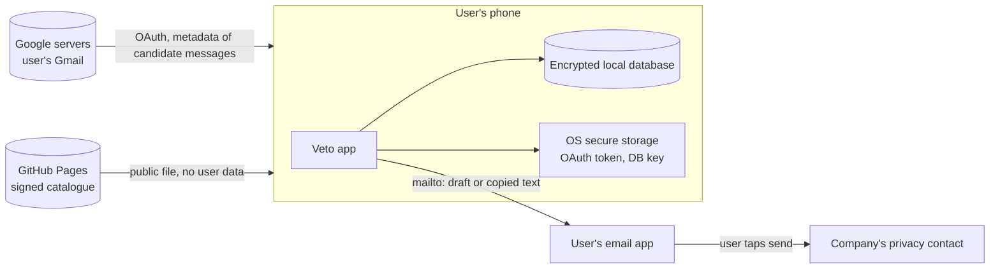

# Veto: Security and Privacy

> Companion to [MVP_SCOPE.md](MVP_SCOPE.md) and [PRODUCT_STRATEGY.md](PRODUCT_STRATEGY.md). Status: draft waiting for review.
>
> This document describes where data goes, what permissions Veto asks for, how data on the phone is protected, what can go wrong, and what must be done before a public launch.

## 1. The privacy promise

Veto uses one sentence, and only this sentence, to describe how it handles email:

> **Emails downloaded by the app are analysed on the device. Veto does not receive or store emails or exposure maps on its servers.**

This wording is deliberate. Emails come from Google's servers to the phone, so it would be false to say they "never leave" anywhere. The network also carries technical traffic (IP address, connection metadata) to Google, to the catalogue host, and to the app stores. What Veto can honestly promise is that **its own infrastructure never receives the content or the results**.

Phrases the team must not use in the app, the website, the pitch, or the privacy policy:

- "We collect nothing" or "zero data".
- "Your emails never leave your phone."
- "We only have access to the emails we analyse." (The `gmail.readonly` scope technically allows reading all mail, even if Veto only asks for some.)
- "Guaranteed private" or "100% secure".

## 2. Data flow

| Data | Where it comes from | Where it is stored | Who else can see it |
|---|---|---|---|
| Email metadata (sender, subject, date) | Gmail API | Processed in memory; only results are kept | Google (it already holds the mailbox) |
| Exposure results (companies, categories, evidence) | Produced on the phone | Encrypted local database | Nobody outside the phone |
| Request history, dates, notes | Entered by the user | Encrypted local database | Nobody outside the phone |
| Request text sent to a company | Prepared by Veto, sent by the user | User's email app and mailbox | The company receiving it, and the user's email provider |
| OAuth token | Google | OS secure storage (Keychain, Keystore) | Nobody outside the phone |
| Company catalogue | GitHub Pages | Cached on the phone | Public |

## 3. External dependencies

"The catalogue is the only thing Veto hosts" is true. It is not the only external dependency. The product relies on:

- **Google OAuth and the Gmail API**, to authorise and read metadata.
- **The app distribution channel**: direct APK install and iOS development builds this semester; Google Play and the App Store later.
- **The user's email app**, which actually sends each request.
- **GitHub Pages**, which serves the catalogue.
- Later, **Apple and Google payment systems**, if paid plans are introduced.

Each of these can fail, change its rules, or see technical traffic. The app must keep working in demo mode, and keep showing the local history, if any of them is unavailable.

## 4. OAuth permissions

**Scope.** Veto requests `gmail.readonly`. The app then asks the Gmail API only for candidate messages, and only for their metadata where possible. The permission granted by the user is still broader than what the app uses, and the consent screen and privacy policy must say so plainly.

**Testing mode.** During the semester, the Google project stays in Testing mode:
- Only accounts on the test user list can connect, and they see an "unverified app" warning.
- For projects like this one, **refresh tokens expire after about seven days**, so testers have to authorise again roughly once a week. This fits Veto's model of connecting for each scan.
- Testing mode does not remove the obligation to protect testers' data and to follow Google's API policies.

**Connection per scan.** "Temporary connection" is a behaviour Veto has to build, not something OAuth provides automatically. After a scan, the app can revoke or discard the token, and ask again at the next scan. The team decides in Phase 0 whether the token is revoked after every scan or kept until the user disconnects; either way, "Disconnect Gmail" and "Delete everything" must revoke it, and this must be checked in the user's Google account settings.

## 5. Local storage and threat model

Local analysis does not make local data automatically safe. The list of companies someone deals with, and their request history, can reveal a lot about them: health services, dating apps, debt collectors, political organisations. The phone is where this data lives, so the phone is where it has to be protected.

### What we protect

- The OAuth token.
- The exposure results and the evidence behind them.
- The request history, notes, and dates.
- The user's name and email address inside drafts.

### Threats and controls

| Threat | Control in the MVP |
|---|---|
| **Lost or stolen phone.** | Local database encrypted (for example SQLCipher, or the framework's encrypted storage), with the key held in Keychain or Keystore. Optional app lock with the phone's biometrics or PIN. |
| **Automatic cloud backups** copying the database to iCloud or Google Drive. | Veto's data files excluded from system backups (iOS backup exclusion attribute; Android backup rules / `allowBackup` disabled for these files). The history is therefore lost with the phone, which the user is told about. |
| **Screenshots and the app switcher** showing results to others. | Sensitive screens hidden in the app switcher on iOS and Android. On Android, screenshots of sensitive screens blocked (`FLAG_SECURE`); iOS does not allow blocking screenshots, so the switcher view is covered instead. |
| **Development logs and crash reports** containing senders, subjects, or tokens. | No email content, company names, or tokens written to logs in release builds. No third-party analytics. If a crash reporter is used, it is configured to exclude all user data, and its use is stated in the privacy policy. |
| **Tampered catalogue** redirecting requests to an attacker's address. | Catalogue served over HTTPS and signed by the team; the app verifies the signature before using it, and keeps the last valid version if verification fails. |
| **"Delete everything" or disconnection not working.** | Both are tested explicitly in Milestone B: local files removed, key destroyed, token revoked. |
| **Other apps on the phone.** | Data kept in the app's private storage; no shared folders, no clipboard use except when the user taps "Copy request". |

**Action:** open a GitHub issue "Threat model and local data protection" with this table as a checklist. Each row gets a test before Milestone B is signed off.

### Losing or replacing the phone

With no account and no server, the history exists only on the phone. In the MVP this is accepted and stated clearly in onboarding and on the "Delete everything" screen. After the MVP, the user will be able to create an **encrypted export file**, protected by a password only they know, keep it where they choose, and import it on a new phone. Veto never holds a copy.

## 6. What can be said honestly

- Veto does not operate a server that receives or stores users' emails or exposure maps.
- The analysis of downloaded emails happens on the device.
- Data on the device is encrypted and excluded from system backups.
- Google, the catalogue host, and the app stores receive the technical traffic that any app generates. Veto does not log or correlate it.
- The request templates are legally reviewed and cite the correct GDPR articles.
- The user can wipe everything and revoke Gmail access in one action.

The app's privacy policy must match this list exactly.

## 7. Architectural rule

Written in the repository and checked in code review:

> No feature may send email content, email metadata, or exposure results to a server (Veto's or a third party's) unless it first goes through a new data protection risk assessment and a review of the Google verification requirements. AI features run on the device by default.

This rule protects the privacy promise, and it also keeps Veto outside the external security assessment that Google requires when restricted data passes through an app's servers (see Section 8).

## 8. Requirements before a public launch

| Situation | What it means for the team |
|---|---|
| Prototype with fictional emails | The product can be developed and demonstrated without connecting real inboxes. Google OAuth verification is not needed. |
| Limited testing with real Gmail | Testing mode allows defined test users, with an "unverified app" warning. This does not remove the duty to protect their data or to comply with the API's policies. |
| Public launch with Gmail access | Restricted permissions such as `gmail.readonly` generally require OAuth verification before production use. Google reviews the justification for the scopes, the consent screen, and the privacy policy. |
| Restricted data passing through Veto's servers | Google requires an external security assessment by an approved assessor, repeated at least once a year. This applies if a backend receives emails or forwards them to an AI service. The architectural rule in Section 7 is designed to avoid it. |
| Processing personal data | The GDPR requires security measures proportionate to the risk, and regular testing of those measures. It does not automatically require ISO 27001 or SOC 2 for a startup. |
| Processing likely to be high-risk | A Data Protection Impact Assessment (DPIA, in Portuguese AIPD) may be mandatory before starting. Whether Veto falls into this category depends on the final design and scale, but analysing mailboxes, especially with AI, justifies a formal assessment. |

### Preparing during the semester

So that verification is not a surprise later, the team prepares during the semester:

- A public privacy policy that matches Section 6.
- A project domain and home page.
- The consent screen text and a written justification for `gmail.readonly`.
- A first version of the DPIA, based on this document.

### A path that does not depend on Google verification

After the MVP, Veto will also accept **email export files** (`.mbox` from Google Takeout, `.eml` files from other clients), processed on the device. This lets people use Veto without OAuth at all, works with providers other than Gmail, and gives the product a public path even while Google verification is pending.

### When to revisit this document

- Before any public release.
- When a feature changes what data is processed or where (for example, reply assistance in paid plans, or any AI model).
- When Google or Apple change their policies for restricted scopes or background processing.
